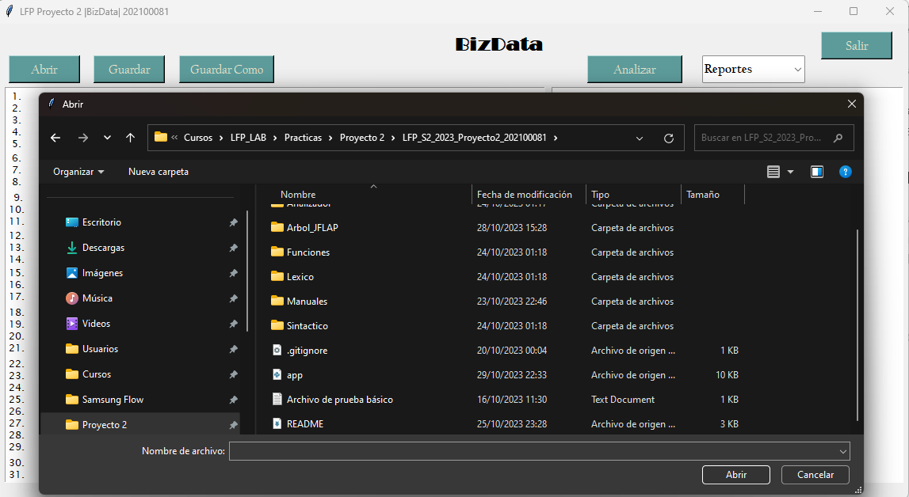
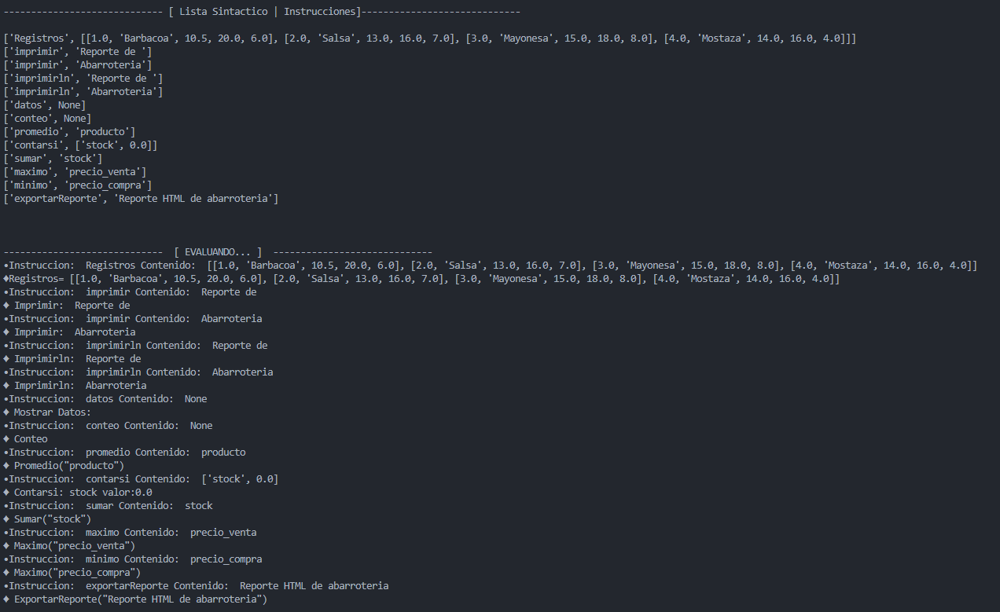

# Bienvenido al Manual de Usuario
BizData (Business Data Analysis) es una plataforma diseñada para que las pequeñas empresas puedan tomar decisiones fundamentadas y estratégicas basadas en el análisis profundo de sus datos comerciales. La tarea del estudiante de Lenguajes Formales y de Programación es crear un analizador léxico y sintáctico, utilizando Python, que permita a las empresas cargar y analizar datos estructurados en un formato especializado con extensión “.bizdata”.

## Menu Principal

Cuenta con interfaz sencilla y minimalista, que le permite al usuario ciertas funciones basicas y detallas del programa, entre ellas: Abrir un archivo, Guardar, Guardar como, Analizar,Reportes, Errores, Tokens, Arbol y salir del propio programa.

[Menu principal]

    

  

    

 

Ademas de las funcionalidades, cuenta con un area de texto o del programa en el que el usuario podra verificar el contenido del archivo abierto en pantalla para su uso intuitivo y sencillo del manejo del archivo.

## Ventana Abrir
[cargar archivo]

    
    
    

  

Al presionar el boton abrir, se desplega un cuadro de dialogo, en el que el usuario podra seleccionar cualquier tipo de archivo, unicamente con la restriccion detallada, que el tipo de archivo que acepta el programa es unicamente con extension "JSON". Cualquier otro tipo de archivo, no se podra cargar en el sistema.

## Opciones Guardar y Guardar Como

Al abrir algun archivo que sea con el formato que acepta el programa se debera visualizar de la siguiente manera:

    

  

Basicamente se muestra todo el resultado del archivo abierto, dentro del area de texto, en el cual el usuario podra editar, si asi lo desea.

Entre las opciones de guardado:

- **Guardar**: Al presionar el boton Guardar, el programa automaticamente guarda los cambios realizados en el area de texto, en el archivo abierto, con el mismo nombre con el cual ha sido abierto.

    

  

- **Guardar Como**: Al presionar el boton Guardar Como, se visualizara un cuadro de dialogo en el cual podremos guardar el archivo actual en cualquier parte de nuestro ordenador, con cualquier nombre que nosotros deseemos, o con el mismo nombre con el que ha sido abierto, con el unico detalle que al guardarlo con el mismo nombre reemplazara el archivo actual.

    
    

 

## Boton Analizar

Al presionar el botón "Analizar", el programa analizara el contenido actual en el area de texto, y automaticamente generara un archivo json, que se encontrara visible en la carpeta "json", con un nombre especifico.

    

  

    

  

    

  

    

  

Al analizarlo automaticamente pedimos que se creara el reporte en general de los tokens, errores y el arbol, en el cual se podra visualizar en la carpeta "del proyecto", con un nombre especifico y siendo un html.

    
    
     

## Boton Errores

Al presionar el botón "Errores", el programa analizara cada uno de los errores en cualquier parte del contenido visible en el archivo de texto y automaticamente generara un archivo html, con el nombbre Reporte_Errores.html

## Salir
Por ultimo, el usuario podra salir del programa totalmente simplemente presionando el boton "Salir".

    

  